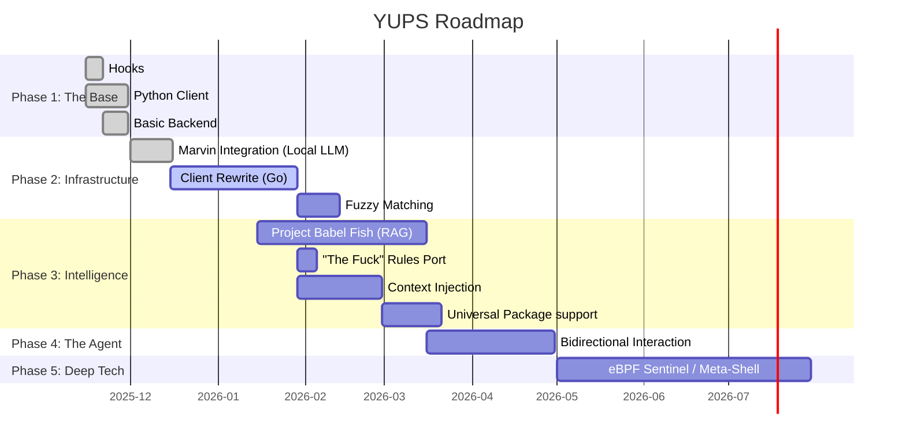

# **YUPS (Your Universal Prompt Straw-boss🧑‍🌾)**

**"If you are not embarrassed by the first version of your product, you’ve launched too late."**

YUPS is an intelligent CLI assistant designed to learn, suggest, and correct terminal errors. Currently in active development (and continuous learning).

This MVP (Minimum Viable Product) currently focuses on capturing:

1. **Command Not Found** errors for common package managers.  
2. **Command Errors** from package manager commands.  
3. **User Queries** via the `yups` command for logging and assistance.

## **🗺️ Roadmap & Project Status**

This project is developed during weekends under the Spoon Theory philosophy: we advance as energy permits, prioritizing 'Quick Wins' and learning over immediate perfection. If you notice the roadmap is advancing at a cruising speed rather than warp speed, please bear with us. Feature merges are not accomplished by magic, but rest assured they are coming.



### **🏁 Phase 1: The Base (Proof of Concept)**

*Current state. Functional and useful, but with room for improvement.*

* \[x\] **Bash Hooks:** Basic implementation of `command\_not\_found`.  
* \[x\] **Python Client:** Simple logic for backend communication.  
* \[x\] **Basic Backend:** API on Trillian using Hugging Face (Gemma 3 27b).  
* \[x\] **Functionality:** Package suggestions and manager translation (apt, dnf, pacman, zypper).

Built with AI Assistance: Parts of this code were generated or refactored using LLMs (Gemmini 3) to accelerate development and learning.

### **🚀 Phase 2: Infrastructure & Speed (Current Focus)**

*Goal: Robustness, speed, and data sovereignty.*

* \[x\] **Operation Marvin (Local LLM):**  
  * \[x\] Deploy Ollama on local server (Marvin).  
  * \[x\] Configure Trillian API to prioritize Marvin with HF fallback.  
* \[ \] **The Great Rewrite (Go):**  
  * \[ \] Migrate client from Python to Go for fast, static binaries.  
  * \[ \] Implement auto-update system.  
* \[ \] **Fuzzy Matching:**  
  * \[ \] Implement local fuzzy search to fix typos in PATH commands (e.g., `sl` \-\> `ls`) without LLM calls.

### **🧠 Phase 3: Brain & Context**

*Goal: YUPS understands what is actually happening.*

* \[ \] **Project Babel Fish (LLM Enhancement):**  
  * \[ \] Integrate RAG (Retrieval Augmented Generation) with technical sources: `man pages`, `tldr`, `navi` cheatsheets, Arch Wiki.  
  * \[ \] Refine system prompts.  
* \[ \] **"The Fuck" Legacy:**  
  * \[ \] Port/Adapt the most useful heuristic rules from `thefuck` to native Go.  
* \[ \] **Context Injection:**  
  * \[ \] Send extra info to backend: `ls` of directory, recent history commands, exit codes.  
* \[ \] **Universal Package Support:**  
  * \[ \] Add specific support for `flatpak`, `snap`, and `appimages`.

### **🤖 Phase 4: The Agent (Interaction)**

*Goal: Moving from "Suggesting" to "Investigating".*

* \[ \] **Information Loop:** Allow the LLM to request safe information commands (`ls`, `cat config`, `find`) from the client to diagnose issues before solving.  
* \[ \] **Security Protocol:** Define a strict whitelist of commands the LLM can request automatically.

### **🔮 Phase 5: Deep Tech & God Mode (Future)**

*Goal: Black magic and total control.*

* \[ \] **Safe Execution (Exploratory):**  
  * \[ \] Investigate viability of automatic "Dry Runs" for complex commands.  
* \[ \] **The Sentinel (eBPF):**  
  * \[ \] Background daemon to capture real `stderr` and output without re-execution.  
* \[ \] **YUPS Shell (Meta-Shell):**  
  * \[ \] Terminal wrapper for predictive AI autocomplete and real-time correction.


## **💻 Requirements (Phase 1 / Python Version)**

* `python3` (3.7 or higher)  
* `bash` (with a `\~/.bashrc` file)  
* `sudo` (to install the script to `/usr/local/bin`)  
* `sed` (for safely modifying `.bashrc`)

## **🛠️ Installation**

1. Clone this repository or download the `yups`, `install.sh`, and `uninstall.sh` files.  
2. Make the scripts executable:  
   ```
   chmod \+x install.sh uninstall.sh yups
   ```
3. Run the installer **as your normal user** (not as root):  
   ```
   ./install.sh
   ```
   *The script will ask for your sudo password when it needs to copy the `yups` executable to `/usr/local/bin`.*  
4. Reload your shell configuration to activate the hooks:  
   ```
   source \~/.bashrc
   ```
   *(Or simply open a new terminal).*

YUPS (Yet Universal Prompt Straw-Boss) is designed to be your personal CLI Foreman. Its only job is to get its hands dirty and execute the tedious tasks. Think of yourself as the System Architect; give YUPS a high-level command and let it handle the errors, dependencies, and obscure syntax. You can remain relaxed, worry-free (and don't forget to pack your towel). YUPS will only ever do what you explicitly ask, with no surprises

## **🧪 Testing the Features**

You can test the three core features:

### **Test 1: Command Not Found (CNF) Hook**

If you are on a system that uses apt (like Ubuntu), try to use a different package manager:
```
dnf install nano
```
YUPS will intercept this, and you should see:
```
YUPS: Command 'dnf' not found.  
YUPS: Maybe you meant 'apt'?  
YUPS: Try 'yups dnf install nano'
```
### **Test 2: Command Error (CE) Hook**

Type a command for your system's package manager with a typo:
```
sudo apt instal nano
```
The command will fail as usual. Then, YUPS will intercept the error and print:

## **YUPS: The command 'sudo apt instal nano' failed (Code: 100). YUPS: Did you mean 'install'? YUPS: Try 'yups sudo apt instal nano'**

### **Test 3: YUPS Log Command**

Run the yups command with any query:
```
yups how do i install nano
```
YUPS will log your query and system information. You can check the created files:
```
\# See your system's cached configuration  
cat \~/.yups/config.json

\# See the log of your query  
cat \~/.yups/yups.log
```
## **🗑️ Uninstallation**

1. Run the uninstaller **as your normal user**:  
   ```
   ./uninstall.sh
   ```
2. The script will remove the executable and cleanly remove the hooks from your `.bashrc` file.

3. It will ask you if you also want to remove the `~/.yups` directory, which contains your logs and configuration.

4. Reload your shell to complete the uninstallation:
```
source ~/.bashrc
```
4. It will ask you if you also want to remove the \~/.yups directory, which contains your logs and configuration.  
5. Reload your shell to complete the uninstallation:  
   source \~/.bashrc  
